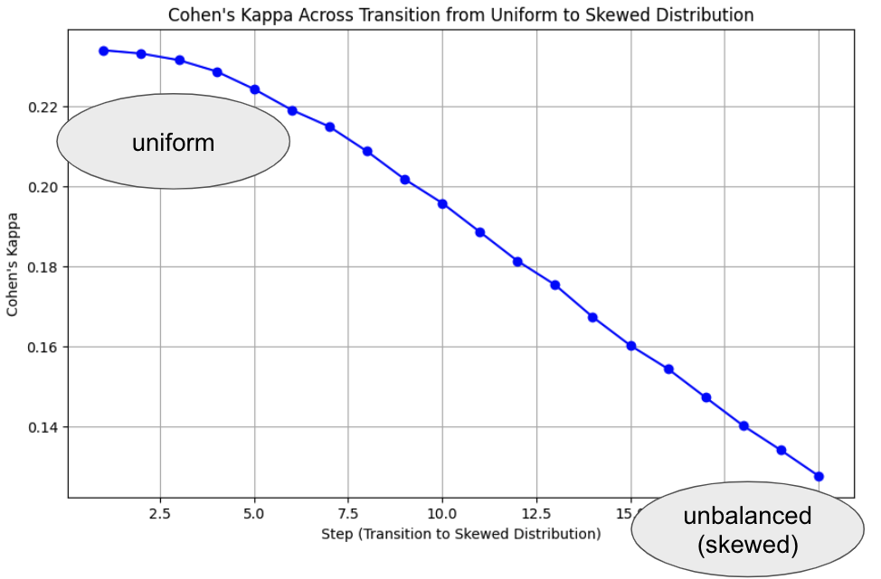

# Kappa Behavior Analysis

This repository analyzes the behavior of the Cohen (and Fleiss) kappa value in detail, focusing on how it is influenced by chance agreement calculations.

## Summary

Kappa values are sensitive to label distribution. When labels are unbalanced, the calculation for chance agreement can unfairly penalize the kappa value.

The plot below illustrates this effect:

- The left side represents a uniform label distribution.
  - E.g., `{1: 2000, 2: 2000, 3: 2000, 4: 2000, 5: 2000}`, where each label has an equal number of samples
- The right side shows an unbalanced (or skewed) distribution.
  - E.g., `{1: 3, 2: 20, 3: 106, 4: 489, 5: 2000}`; the number of samples per label is uneven.

In both cases, they are sampled from the same data, but with different label distributions.

This plot shows that the kappa value is disproportionately low when the label distribution is skewed, even though both sets are sampled from the same data.

When using the kappa statistic to measure inter-annotator agreement, the goal is to assess consistency between annotators, regardless of label distribution. Thus, the label distribution shouldn't impact the agreement level, as it doesn’t affect the quality of the annotators.

However, in reality, kappa values are influenced by label distribution, which can misrepresent agreement.
